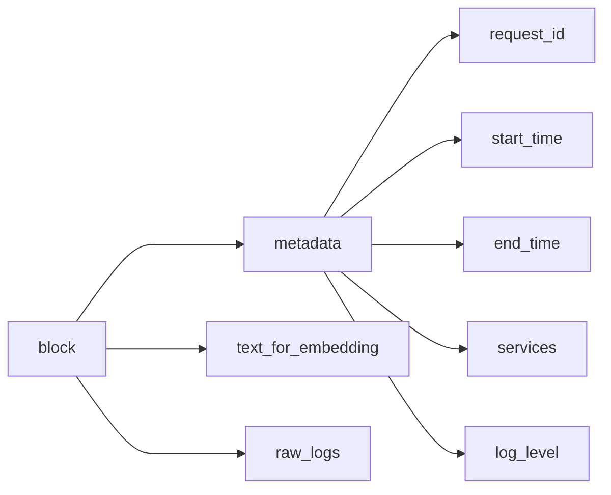

正则表达式
https://blog.csdn.net/2201_75786273/article/details/147455597?ops_request_misc=%257B%2522request%255Fid%2522%253A%25220e8eaf8b0620fddf2d98ad0a32ea1e79%2522%252C%2522scm%2522%253A%252220140713.130102334..%2522%257D&request_id=0e8eaf8b0620fddf2d98ad0a32ea1e79&biz_id=0&utm_medium=distribute.pc_search_result.none-task-blog-2~all~top_positive~default-2-147455597-null-null.142^v102^control&utm_term=%E6%AD%A3%E5%88%99%E8%A1%A8%E8%BE%BE%E5%BC%8F&spm=1018.2226.3001.4187

